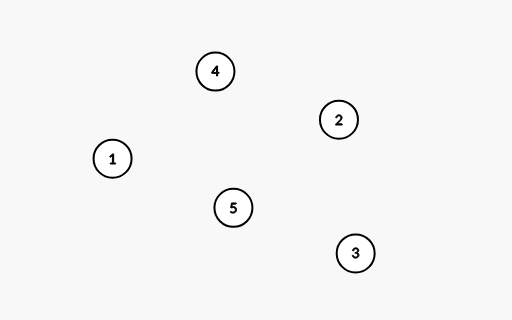
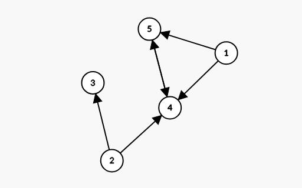
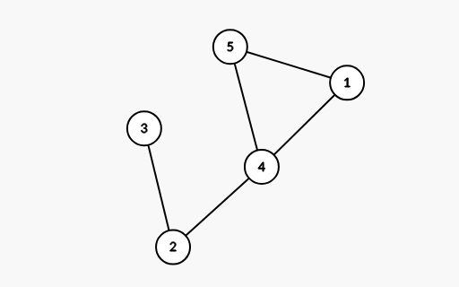

# Grafuri

Teoria grafurilor este una dintre cele mai practice și aplicate ramuri ale matematicii discrete. În viața de zi cu zi, suntem înconjurați de tot felul de grafuri: că ne referim la Waze, harta de metrou sau chiar relațiile de follow pe Instagram, toate aceste lucruri se pot reprezenta sub formă de grafuri orientate / neorientate.

## Teoria de bază

Un **nod** este o entitate, o intersecție, un reper. Ele, de obicei, vor fi notate cu numere și în desene le vom găsi sub forma următoare:



Între noduri, noi vom trasa muchii. Muchiile (și grafurile) pot fi de două feluri:

* Orientate



* Neorientate



În cazul grafurilor orientate, mereu orientarea va fi indicată cu o săgeată pusă pe muchie. În cazul muchiilor neorientate nu va exista săgeată.

De obicei, o muchie de la nodul $X$ la nodul $Y$ (adică orientată de la $X$ la $Y$) o vom scrie, când ne referim la ea într-un enunț, ca $(X, Y)$. Dacă muchia este neorientată, nu contează daca $X$ apare înainte de $Y$ sau invers.

## Reținerea grafurilor în memorie

Reținerea grafurilor în memorie poate părea un pic greu la început, dar, în practică, nu e deloc greu. Grafurile putem să le reținem în două moduri:

* Matrice de Adiacență

Vom declara o matrice de $N \times N$, care va fi completată în felul următor:

$$
A_{ij} =
\begin{cases}
1, & \text{dacă există muchie de la nodul } i \text{ la nodul } j, \\
0, & \text{altfel.}
\end{cases}
$$

* Liste de Adiacență

Pentru fiecare nod în parte, vom ține o listă (adică un `vector <int>`) unde vom reține toate nodurile cu care noi avem muchie. O astfel de inițializare poate fi privită mai jos:

```cpp
const int maxN = 1e5 + 5;

vector <int> muchii[maxN];

...

while (m--) // iterăm prin toate muchiile
{
    int x, y;
    cin >> x >> y;
    muchii[x].push_back(y);
    muchii[y].push_back(x); // doar în cazul grafurilor NEORIENTATE
}
```

Astfel, vom aloca doar $O(M)$ memorie (+ o constantă, depinde cât de mare e graful).

Vom numi $deg[i]$ gradul nodului $i$, adică numărul de muchii care au o extremitate în nodul $i$. În cazul grafurilor neorientate, se poate defini gradul de intrare $deg_{in}[i]$ și gradul de ieșire $deg_{out}[i]$.

## Parcurgerea grafurilor

Parcurgerea grafurilor este un subiect foarte important, deoarece multe probleme din teoria grafurilor se bazează pe parcurgerea corectă a acestora. O să observați că parcurgerile grafurilor sunt foarte similare cu Fill și Algoritmul lui Lee. Cele mai cunoscute două metode de parcurgere sunt:

* Parcurgerea în Adâncime (**DFS** - Depth First Search)

Mai știți cum funcționa Fill-ul? Exact la fel funcționează și DFS-ul. Pornim dintr-un nod, îl marcăm ca vizitat și apoi încercăm să mergem cât mai adânc posibil pe fiecare ramură. Dacă nu mai putem înainta, ne întoarcem înapoi și încercăm o altă ramură.

Mai jos, o să vă las un exemplu de implementare a DFS-ului folosind liste de adiacență (sursa completă o găsiți în [`dfs.cpp`](https://github.com/IvanGuvidu/Hai-la-olimpiada-2025-2026/blob/main/11-12/Curs02/dfs.cpp)):

```cpp
bool vizitat[maxN];      // vector pentru a marca nodurile vizitate

void dfs (int nod)
{
    vizitat[nod] = true;
    for (auto vecin : muchii[nod]) // cu aceasta buclă iterăm prin toți vecinii nodului curent
    {
        if (!vizitat[vecin])
        {
            dfs(vecin);
        }
    }
}
```

Astfel, acest algoritm va avea complexitate $O(N + M)$, unde $N$ este numărul de noduri, iar $M$ este numărul de muchii. O să vedem în exemplul de la BFS că dacă folosim matrice de adiacență, complexitatea va crește la $O(N^2)$.

* Parcurgerea în Lățime (**BFS** - Breadth First Search)

BFS-ul este foarte asemănător cu Algoritmul lui Lee. Pornim dintr-un nod, îl marcăm ca vizitat și îl adăugăm într-o coadă. Apoi, în fiecare pas, scoatem un nod din coadă, vizităm toți vecinii săi nevizitați, îi marcăm ca vizitați și îi adăugăm în coadă. Acest proces continuă până când coada este goală. Cu o parcurgere BFS, putem găsi cel mai scurt drum într-un graf (fără costuri diferite de $1$, o să avem un curs dedicat pentru cum putem trata grafurile cu costuri). Mai jos, o să vă las un exemplu de implementare a BFS-ului folosind matrice de adiacență (sursa completă o găsiți în [`bfs.cpp`](https://github.com/IvanGuvidu/Hai-la-olimpiada-2025-2026/blob/main/11-12/Curs02/bfs.cpp)):

```cpp
queue <int> q;    // Coada pentru BFS
bool visited[maxN]; // Vector pentru a marca nodurile vizitate

void bfs (int start, int n)
{
    q.push(start);
    visited[start] = true;

    while (!q.empty())
    {
        int nod = q.front();
        q.pop();

        // Explorăm toți vecinii nodului curent
        for (int i = 1; i <= n; i++)
        {
            // Dacă există muchie și nodul nu a fost vizitat
            if (adj[nod][i] == 1 && !visited[i])
            {
                q.push(i);
                visited[i] = true;
            }
        }
    }
}
```

Astfel, acest algoritm va avea complexitate $O(N^2)$ când folosim matrice de adiacență, dar poate fi redus la $O(N + M)$ dacă folosim liste de adiacență.

Dupa cum vedeți, fiecare parcurgere ne oferă avantaje diferite, iar alegerea între DFS și BFS depinde de problema specifică pe care o avem de rezolvat. De asemenea, este important si ce alegem intre liste de adiacență și matrice de adiacență, în funcție de densitatea grafului și de operațiile pe care dorim să le efectuăm. Vom vedea in cursurile urmatoare ca uneori ne este mult mai avantajos (dpdv al implementarii) să folosim una dintre aceste reprezentări în locul celeilalte.

## Probleme

* [Barbar](https://infoarena.ro/problema/barbar)
* [Aventura](https://kilonova.ro/problems/3615)
* [Reinvent](https://kilonova.ro/problems/174)
* [Patrol](https://kilonova.ro/problems/302?list_id=76)
* [Labirint](https://kilonova.ro/problems/938?list_id=270)
* [Pulsar](https://kilonova.ro/problems/285)

## Resurse suplimentare

* [Graph editor](https://csacademy.com/app/graph_editor/)
* [BFS - CP-Algorithms](https://cp-algorithms.com/graph/breadth-first-search.html)
* [DFS - CP-Algorithms](https://cp-algorithms.com/graph/depth-first-search.html)

#### Cursul de azi a fost ținut de Ivan Andrei-Cristian.
