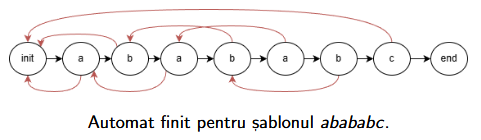

# Meet in the middle, KMP, Hashing

## Meet in the middle

De multe ori, ne vom lovi cu probleme pe care știm să le rezolvăm în timp exponențial $O(2^N)$, dar ca, $N$ uneori poate este prea mare. O idee ar fi să împărțim problema în două, astfel încât fiecare jumătate să aibă o dimensiune de $N/2$. Dacă putem rezolva fiecare jumătate în timp $O(2^{N/2})$, atunci putem combina cele două jumătăți în timp $O(2^{N/2} \cdot 2^{N/2}) = O(2^N)$, ceea ce este mult mai eficient decât $O(2^N)$. Singura parte a problemei care rămâne este să găsim o modalitate de a combina cele două jumătăți într-un mod eficient. Tehnica de mai sus poartă numele de **meet in the middle**.

* [Vopsea](https://kilonova.ro/problems/2834)
* [Tratatul pacii](https://www.hackerrank.com/contests/bpc2025/challenges/tratatul-pacii)

## KMP

O problemă clasică în algoritmică este să determinăm dacă un șir de caractere $P$ (pattern) se regăsește ca subsecvență într-un alt șir de caractere $S$.

O abordare a acestei probleme în timp $O(|S| + |P|)$ este algoritmul **Knuth-Morris-Pratt (KMP)**. Acest algoritm se bazează pe ideea de a construi un automat finit, iar pentru fiecare poziție din șirul $P$ vom ține un vector $\pi(i)$ care va conține lungimea celui mai lung prefix al lui $P$ care este și sufix al prefixului $P[0..i]$. Când trecem de la poziția $i$ la poziția $i+1$, vom încerca să vedem dacă caracterul $P[i+1]$ se potrivește cu caracterul $P[\pi(i)]$. Dacă se potrivește, atunci vom incrementa $\pi(i+1)$ cu 1. Dacă nu se potrivește, atunci vom încerca să vedem dacă caracterul $P[i+1]$ se potrivește cu caracterul $P[\pi(\pi(i))]$, și tot așa, până când găsim o potrivire sau ajungem la poziția 0.

Un exemplu de automat pentru cuvântul `abababc` este următorul:

    

O implementare a algoritmului KMP poate fi găsită [aici](kmp.cpp).

* [String matching](https://infoarena.ro/problema/strmatch)
* [Prefix](https://infoarena.ro/problema/prefix)

## Hashing

O altă tehnică pentru a rezolva probleme legate de string matching este **hashing-ul**. Ideea de bază este să atribuim fiecărui șir de caractere un număr întreg (hash-ul) astfel încât dacă două șiruri de caractere sunt egale, atunci hash-urile lor să fie egale, iar dacă două șiruri de caractere sunt diferite, atunci hash-urile lor să fie diferite cu o probabilitate foarte mare. Un mod comun de a calcula hash-ul unui șir de caractere este să folosim o funcție de hash de forma:

$$H(s) = (s[0] \cdot p^{n-1} + s[1] \cdot p^{n-2} + ... + s[n-1] \cdot p^{0}) \mod M$$

**De obicei**, se alege $p$ ca fiind un număr prim (de exemplu, dacă va trebui să lucrăm cu litere mici, putem alege $p = 31$), iar $M$ ca fiind un număr prim mare (de exemplu, $M = 1e9 + 7$).

Pentru a calcula hash-ul unui substring $s[i..j]$, putem folosi urmatoarea formula:

$$H(s[i..j]) = (H(s[0..j]) - H(s[0..i-1]) \cdot p^{j-i+1}) \mod M$$

* [Ratina](https://infoarena.ro/problema/ratina)
* [Granite](https://infoarena.ro/problema/granite)
* [Tetris2](https://www.infoarena.ro/problema/tetris2)

#### Cursul de azi a fost ținut de Ivan Andrei-Cristian.